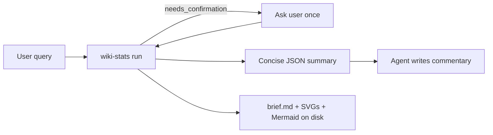
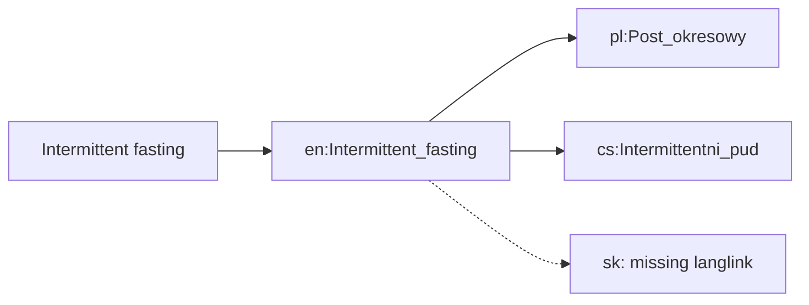

# wiki-stats Agent Skill — Case Elaboration & Dev Plan

## Case, elaborated

**Problem.** B2C founders need a cheap signal for “what topic / which language wiki audience to explore next.” Wikimedia pageviews are not purchase intent, but they are public, multi-language, and time-series—good enough to prioritize *what to validate next*.

**User jobs (from the brief).**
- Compare interest growth for a topic across language Wikipedias over a time window.
- Judge whether growth on one wiki is real vs noisy (spikes, seasonality, tiny base).
- Rank audiences / topics and produce a short shareable brief.

**Non-goals for MVP (3h).**
- PDF generation (document in iteration roadmap; shape `brief.md` + charts so a 1-page PDF is a thin later step).
- Wikidata / category-graph topic expansion (high debug risk; agent or user supplies topics).
- Causal claims, monetization prediction, interactive dashboards.

**Success for MVP.** An agent on a Haiku-class model, using only this skill’s instructions + CLI, can answer the three example prompts with: resolved titles, a **small JSON summary** (not raw series), SVG chart(s), **Mermaid concept/relation diagram(s)** embedded in the brief, caveats, and a `brief.md`—without inventing ad-hoc analysis code each run.

---

## Ideas pulled from [vision.md](genesis/ai-school/test-case/vision.md)

Keep our locked MVP (`brief.md`, auto-resolve, no PDF in sprint). Adopt these bright ideas:

1. **LLM = strategist, CLI = worker (hard rule).** Never dump raw multi-year daily series into the model context. Scripts fetch, aggregate, chart, and write files; stdout is a **concise JSON summary** (totals, per-lang share, growth slope, spike dates, paths to artifacts). The agent narrates recommendations from that summary + `brief.md`.
2. **Prefer one-shot `run` over multi-step tool loops.** Haiku struggles with long stateful tool chains; one CLI invocation does resolve→fetch→analyze→chart→brief. Step commands remain for debugging / follow-ups that hit cache.
3. **Language demand split.** Analyze computes each language’s share of combined views in the window (helps “which locale to explore next”).
4. **Concrete growth slope.** Prefer “recent window vs same window ~12 months earlier” (e.g. last 30d vs 30d a year ago, or last 3 months vs same 3 months YoY) over vague “growth %”.
5. **Two-chart pack (as SVG, not matplotlib PNG).** (a) horizontal bar: language demand share; (b) multi-series trend with simple rolling mean when granularity is daily.
6. **Mermaid relation diagrams in the loop** (see below) — structural “how topics/langs connect,” complementing quantitative SVGs.
7. **Brief layout borrowed from the 1-page PDF blueprint.** KPI strip → Mermaid map → charts → three takeaways: Language expansion priority / Market momentum / Action item — plus Assumptions & limitations.
8. **Wikidata / category-tree topic expansion stays out of MVP** (high risk in 3h); Mermaid for MVP uses resolve + metrics graph only. Richer concept graphs go on the roadmap.
9. **PDF stays on the roadmap**, reusing KPI + diagrams + three-bullets so PDF is mostly templating later.

What we deliberately do **not** take from vision: Python/matplotlib/weasyprint as MVP stack; PDF-in-MVP; agent-passes-keywords-only (we keep auto-resolve + confirm-on-ambiguity).

---

## Deliverable shape (Agent Skills + Node ESM)

All work lives in [`genesis/ai-school/test-case/wiki-stats/`](genesis/ai-school/test-case/wiki-stats/) (skill root = package root):

```
wiki-stats/
├── SKILL.md                 # frontmatter + workflow for the agent
├── package.json             # "type": "module"; bin → scripts/cli.js; npm lock
├── package-lock.json
├── scripts/                 # ship-as-written ESM .js (no tsc / tsx / build)
│   ├── cli.js               # wiki-stats entry (subcommands + run)
│   ├── resolve.js
│   ├── fetch.js
│   ├── analyze.js
│   ├── chart.js
│   ├── brief.js
│   └── lib/                 # http, cache, mediawiki, aqs helpers
├── references/              # API gotchas, metrics (load on demand)
├── assets/                  # brief.md template
├── evals/evals.json
└── .gitignore               # node_modules, .cache, run outputs
```

**Stack (shaved).**
- Node 20+ ESM JavaScript only — code ships as written (`node scripts/cli.js` or `npx wiki-stats` after `npm install`).
- **Package manager: npm** (`package-lock.json`). No pnpm/yarn.
- **No TypeScript, no transpile, no `tsx`.** Prefer zero or minimal deps (native `fetch`).
- One CLI binary `wiki-stats` with subcommands.

**Why code in the skill.** Scripts own fragile work: encoding, User-Agent, rate limits, langlinks, growth math, SVG. `SKILL.md` tells a small model which command to run and how to read the summary JSON.

**Agent workflow:**



---

## Mermaid in the loop (concept / relation viz)

**Role.** SVGs answer “how much / how fast.” Mermaid answers “how things relate”: topic → pivot article → per-language pages, gaps, and ranked locales. Fits `brief.md` and chat replies; no extra rendering deps.

**Who generates it.** The CLI (`brief` / `run`), from resolve + analyze JSON — **not** free-form LLM Mermaid. Keeps diagrams factual and Haiku-safe. Agent may paste the same fenced block into the chat when helpful.

**MVP diagrams (deterministic templates):**

1. **Resolution map** (`flowchart` or `graph`) — topic → chosen pivot title → each target lang article; dashed node for missing langlinks.
2. **Audience priority map** (`flowchart TB` or ranked links) — languages ordered by share and/or growth slope, edges labeled with share % or slope.

Example shape (illustrative):



**Artifacts.** Embed fenced Mermaid in `brief.md`; also write `relations.mmd` (and optionally include the source string in summary `paths`) so the agent can re-show without re-running.

**Out of MVP / roadmap.** Wikidata “related concepts” Mermaid (P31/P279 or “see also”), multi-topic comparison graphs — after core path is green.

---

## Locked product decisions

- **MVP output:** Concise JSON summary on stdout + SVG chart(s) + Mermaid relation block(s) + `brief.md` on disk.
- **Topic → article:** Auto search → best match → langlinks; ask only on real ambiguity / missing link / multi-sense clash.
- **Stack:** Node 20+ ESM + **npm** (`package-lock.json`); ship `.js` as-is; no build step.
- **Charts:** Two SVGs — lang-share bar + trend line (rolling mean when daily).
- **Relations viz:** CLI-generated Mermaid in brief (resolution map + audience priority); no LLM-invented graphs.
- **Follow-ups:** `.cache/` keyed by project/title/range (gitignore); re-runs reuse fetch.
- **PDF:** Out of MVP; roadmap item that reuses brief structure.

**Resolve policy (streamlined).**
1. Prefer explicit title if given (`uk:Астрономія`).
2. Else search on a pivot wiki (query language, else `en`).
3. Large gap #1 vs #2 → take #1; else `needs_confirmation` with 2–3 candidates.
4. Langlinks to targets; missing link = data gap, never invent titles.

**Pageviews.** AQS `per-article` with defaults: `all-access`, `user`, `monthly` for multi-year, `daily` when window ≤ ~90 days. Identifying `User-Agent`; backoff + cache.

**Analyze outputs (into summary + brief).**
- Totals and **per-language share %**.
- **Growth slope** (recent window vs YoY baseline window).
- Spike / outlier flags; low-volume trust warning.
- Disclaimer: pageviews ≠ willingness to pay.

---

## CLI design (agent-friendly)

JSON summary on stdout; diagnostics on stderr; `--help` everywhere.

- `resolve` / `fetch` / `analyze` / `chart` / `brief` — composable steps (cache-friendly follow-ups).
- **`run --topic ... --langs ... --start ... --end ...`** — happy path for Haiku: writes cache, charts, Mermaid, `brief.md`; prints only the small summary (`articles`, `kpis`, `per_lang[]`, `spikes[]`, `caveats[]`, `paths` including `brief.md`, SVGs, `relations.mmd`).

---

## `SKILL.md` content (lean)

Frontmatter: `name: wiki-stats`, description keyed to Wikipedia interest / localization / B2C topic research, `compatibility: Node 20+, npm, network`.

Body checklist:
1. Parse topics, langs, window (default last 24 months).
2. `npm install` once if needed; run from skill root.
3. Prefer `wiki-stats run ...`; on `needs_confirmation`, ask once, re-run with `--title`.
4. **Do not** paste raw series into the reply; use summary JSON + `brief.md`.
5. Prefer CLI Mermaid from `brief.md` / `relations.mmd` over inventing diagrams.
6. Always surface Assumptions & limitations.
7. On API errors → `references/aqs.md`.

---

## Development phases (~3h)

**Work slicing: stop here.** The five phase blocks below (= the five plan todos) are the execution slices. No further task breakdown — for a 3h sprint that would cost more coordination than it saves. Execute phase-by-phase; if a phase slips, cut within it (e.g. drop second Mermaid template before dropping `run`).

### Phase 0 — Scaffold (15 min)
- `package.json` (`type: module`, bin), `npm install` → lockfile, `.gitignore`, no `tsconfig`.
- `SKILL.md` frontmatter + stub; `assets/brief-template.md` with KPI strip + Mermaid slot + two-chart slots + three takeaways + limitations.

### Phase 1 — Resolve + Fetch (40–50 min)
- MediaWiki search/redirects/langlinks + ambiguity heuristic.
- AQS client + UA + retries + encoding + disk cache.
- Smoke: intermittent fasting → pl/cs; 24 months monthly.

### Phase 2 — Analyze + Chart + Mermaid + Brief (40–50 min)
- Lang share, growth slope, spikes, trust notes → summary schema.
- Two SVG charts (share bar + trend).
- Emit resolution + audience-priority Mermaid (`relations.mmd` + embed in brief).
- `brief` from template; `run` orchestrator printing **only** the summary.

### Phase 3 — Skill polish for Haiku (25–35 min)
- Tighten commands/defaults/gotchas; `references/aqs.md`, `metrics.md`.
- `evals/evals.json` from the three case prompts (assert: summary size small, artifacts exist, Mermaid present, caveats present).

### Phase 4 — Verify + roadmap (20–30 min)
- Smoke without network mocks where easy; one live run; optional Haiku/OpenRouter pass.
- `references/roadmap.md`: 1-page PDF, Wikidata/related-concept Mermaid, relative interest vs project totals, eval loop.

---

## Alignment checklist vs assignment

- Agent Skills format + own code + reproducible deps — yes.
- Meaningful data work in code — yes.
- Charts + relation viz + shareable brief — two SVGs + Mermaid maps + `brief.md`; PDF deferred with reused layout.
- Caveats / follow-ups — analyze notes + cache.
- Cheap-model usable — one-shot `run`, tiny JSON, no raw series in context (vision’s core insight).
- Iteration path — roadmap includes PDF and deeper analytics.

---

## Risks

- Ambiguous topics → confirm early, don’t silent-wrong.
- Cross-wiki scale → share % + absolute levels both in brief.
- AQS limits → cache + backoff from day one.
- Scope creep (PDF, Wikidata, forecast) → refuse until MVP green.
- Accidental “helpful” dump of series into chat → `SKILL.md` forbids it; `run` never prints full series.
- LLM-invented Mermaid with wrong titles → CLI owns diagram text; agent copies, does not freestyle edges.
