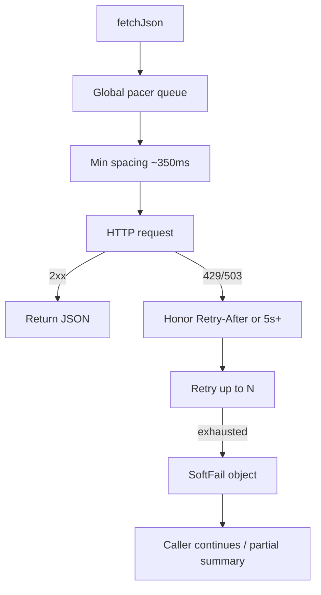

# wiki-stats stabilization phase

## 1. Publishing / e2e install (answer + deliverable)

**There is no “Publish” button on [skills.sh](https://www.skills.sh/).** The directory is a leaderboard over installs. Distribution is: put a valid skill on a git host (or local path), then install with the [skills CLI](https://github.com/vercel-labs/skills):

```bash
# Local e2e (no GitHub required)
npx skills add ~/Dev/genesis/ai-school/test-case/wiki-stats -g -a cursor -y

# After the skill lives in a public GitHub repo
npx skills add <owner>/<repo> -g -a cursor -y
# or path into a monorepo:
npx skills add https://github.com/<owner>/<repo>/tree/main/ai-school/test-case/wiki-stats
```

Discovery expects `SKILL.md` at repo root **or** under known containers (`skills/`, `.agents/skills/`, etc.). Our layout (skill at folder root with `SKILL.md`) already works for `skills add <path-or-tree-url>`.

**Plan work:**

- Add `[references/publish.md](genesis/ai-school/test-case/wiki-stats/references/publish.md)`: local install, GitHub install, Cursor global path (`~/.cursor/skills/`), badge optional, note that skills.sh ranking follows installs not a separate publish API.
- Link it from `[SKILL.md](genesis/ai-school/test-case/wiki-stats/SKILL.md)` (one line).
- E2E check after code fixes: `npx skills add <abs-path> -g -a cursor -y` then confirm skill appears; run one `wiki-stats run` from the installed copy’s directory (or document that CLI is invoked from skill root after install).

**Default for this sprint:** local path install for e2e. Pushing to a specific GitHub remote is out of scope unless you already have a public repo URL ready.

---

## 2. Rate limits + never crash the flow

**Root cause today.** `[scripts/lib/http.js](genesis/ai-school/test-case/wiki-stats/scripts/lib/http.js)` treats 429 like a hard error: after retries it `throw`s; `[cli.js](genesis/ai-school/test-case/wiki-stats/scripts/cli.js)` does not catch → process dumps a stack (terminal 15). Also no global pacing / `Retry-After` parsing; concurrent bursts from resolve+fetch trip [Wikimedia rate limits](https://www.mediawiki.org/wiki/Wikimedia_APIs/Rate_limits) (UA-only ≈ **200 req/min**, recommend **≤3 concurrent**, meaningful UA + contact).




**Implement in `http.js` (shared):**

- **Compliant UA** via `WIKI_STATS_UA` (document required shape: `wiki-stats/0.1 (https://…; email@…)`). Keep a non-placeholder default that still identifies the skill.
- **Global pacer:** single in-process queue; max **1 in flight** for MVP simplicity (safest under “≤3 concurrent”; easy to raise to 2 later); minimum **350ms** between request starts (~170/min headroom under 200).
- **429/503:** read `Retry-After` (seconds or HTTP-date); else wait ≥5s; exponential backoff; more attempts (e.g. 5).
- **Return shape:** either success JSON **or** throw a typed `HttpError` with `{ status, retryable, url }` — callers decide.

**Soft-fail the CLI (critical):**

- Wrap `main` / `cmdRun` in try/catch: always print **one JSON object** to stdout on failure (`{ "status": "error", "error": "…", "http_status": 429 }`), diagnostics to stderr; exit 1 — **never** an uncaught stack as the primary UX.
- In `resolve` / `fetch`: if a single MediaWiki/AQS call soft-fails after retries, mark that article (`status: "fetch_error"` / resolve error field) and **continue** other langs when possible. Prefer partial `status: "ok"` with caveats over total abort when at least one series exists.
- Update `[references/aqs.md](genesis/ai-school/test-case/wiki-stats/references/aqs.md)` with pacer + Retry-After + UA policy.

**Note:** typo `ua` in `--langs` (Ukrainian is `uk`) is user error; optional one-line gotcha in SKILL.md only.

---

## 3. `--log=<file>` request log

Global flag parsed in `[cli.js](genesis/ai-school/test-case/wiki-stats/scripts/cli.js)`, passed into `http` via module setter or `AsyncLocalStorage` / `setLogSink(path)`.

Each paced request appends one line (ISO timestamp), e.g.:
`2026-09-26T18:30:01.123Z GET https://… status=200 ms=412 cache=miss wait_ms=350`

Log: method, full URL, status (or `error`), duration, pacer wait, cache hit if fetch layer knows it (AQS cache can call `logLine` too). Create/append file; create parent dirs. Document in `--help` and SKILL.md.

---

## 4. Schema: `articles[*].url`

In `[resolve.js](genesis/ai-school/test-case/wiki-stats/scripts/resolve.js)` when building articles, and in `[analyze.js` `buildSummary](genesis/ai-school/test-case/wiki-stats/scripts/analyze.js)`:

- Linked/pivot: `url: \`https://${lang}.wikipedia.org/wiki/${encodeURIComponent(title.replace(/ /g,'_'))}` (or reuse title already underscored).
- `missing_langlink` / errors: `url: null`.

Update SKILL.md summary schema line + `evals/evals.json` field list.

---

## Implementation order (~1–1.5h)

1. `http.js` pacer + Retry-After + better retries; soft `HttpError`.
2. CLI catch-all JSON errors; fetch/resolve partial failure.
3. `--log` wiring.
4. `articles[].url`.
5. Docs: `references/publish.md`, aqs/SKILL/evals touch-ups.
6. Verify: two back-to-back `run`s (Smetana / IF) without crash; with `--log=./output/http.log` inspect lines; `npx skills add <path> -g -a cursor -y` smoke.

