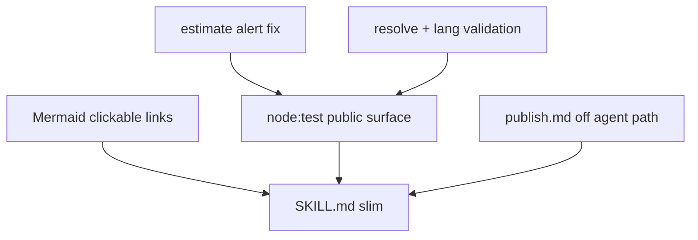

# wiki-stats Phase 3 — quality & UX tighten

## Context vs Phase 2

Phase 2 shipped pacer, JSON errors, `estimate`/`alert`, `--log`, `articles[].url`, and `references/publish.md`. Smoke shows the surface is usable but several contracts are wrong or silent in practice. This phase is **tighten**, not expand product scope (no PDF, no Wikidata).

---

## 1. Why `estimate` never alerts (and fix)

**Root cause.** Formula is correct for cold HTTP:

`requests_est = 3 + N`, `estimation = ceil(requests_est * 350 / 1000)`

So 2 langs → ~2s, 5 langs → ~3s. Phase 2 buckets start at `estimation >= 10` (Brief). Hitting Brief needs ~26 langs; Moderate/Extended are unreachable before the `Infinite` absurd cap at 50 langs. **`alert` is dead for every realistic run.**

**`--months` does not and should not change the estimate.** Monthly AQS is still one GET per lang regardless of span. Document that in `assumptions` (e.g. `months_affect_requests: false`); keep accepting `--months` for flag symmetry with `run`.

**Locked recalibration — alert on `langCount` (matches your smoke examples):**

| Condition                         | `alert`    |
| --------------------------------- | ---------- |
| `langCount < 5`                   | omit field |
| `5–9`                             | `Brief`    |
| `10–19`                           | `Moderate` |
| `20–49`                           | `Extended` |
| `>= 50` (or `requests_est >= 50`) | `Infinite` |

So `--langs pl,cs` (2) → no alert; `--langs pl,cs,ua,en,fr` (5) → `Brief`. Keep `estimation` / `requests_est` as today (seconds / count). Update phrase bank usage in SKILL unchanged; update [`scripts/lib/estimate.js`](genesis/ai-school/test-case/wiki-stats/scripts/lib/estimate.js) only.

---

## 2. Tests (`node:test`, not Vitest)

**Locked:** Node 20 built-in [`node:test`](https://nodejs.org/api/test.html) + `node:assert/strict`. Matches LEARNINGS (zero deps, ship-as-written ESM). No Vitest/Jest.

**Layout:** `wiki-stats/tests/*.test.js`. `package.json`: `"test": "node --test tests/"`.

**Cover public surface only — happy path + distinct expectations (no filler):**

| Module / CLI                        | Assertions                                                                                                   |
| ----------------------------------- | ------------------------------------------------------------------------------------------------------------ |
| `computeEstimate`                   | 2 langs → no `alert`; 5 langs → `Brief`; 10 → `Moderate`; 50 → `Infinite`; exact `estimation`/`requests_est` |
| `estimate` via CLI spawn            | stdout JSON equals helper output (`node scripts/cli.js estimate …`)                                          |
| Lang validation helper              | reject `en:Nirvana`, `ua` (alias), empty, `zztoolong`; accept `uk`,`pl`                                      |
| `buildMermaid`                      | linked node contains `<a href='…'>`; missing node has no href; no `title: null` leakage                      |
| Article JSON shaping                | `missing_langlink` / `invalid_language` omit `title`/`url` keys                                              |
| `parseExplicitTitle` / pivot reject | `--pivot en:Nirvana` → CLI error JSON, no network                                                            |

Network-heavy `resolve`/`run`: **one** mocked or fixture-based unit for empty-pivot → try-langs fallback (inject fake `opensearch`); skip live Wikimedia in CI. Evals in [`evals/evals.json`](genesis/ai-school/test-case/wiki-stats/evals/evals.json) stay agent-level; do not duplicate them as unit tests.

---

## 3. Resolve UX — no `--topic:uk`

**Does multilang `--topic:uk "…"` make sense?** No — reject for this phase.

- Already have `--pivot uk` and `uk:Title` in `--topic`/`--title`.
- Colon-flag syntax collides with `lang:Title` and needs precedence rules vs `--pivot`/`--langs`.
- Agents on Haiku benefit from **fewer** flags, not a third way to say the same thing.

**Why `нірвана` fails today.** Default `--pivot en`; English OpenSearch returns empty for Cyrillic; EN-fallback only runs when first search lang ≠ `en`. No try of `--langs`.

**Locked resolve behavior** in [`scripts/resolve.js`](genesis/ai-school/test-case/wiki-stats/scripts/resolve.js):

1. Keep `--pivot` / `lang:Title` as overrides.
2. On plain `--topic`: OpenSearch on pivot; if **zero hits**, try each code in `--langs` (order preserved, skip already-tried), then `en` if not tried. First non-empty candidate list wins; existing `pickSearchResult` / `needs_confirmation` unchanged.
3. SKILL one-liner: non-Latin query → prefer `--pivot` matching that wiki, or `lang:Title` when known.

**Omit nulls:** for `missing_langlink` and `invalid_language`, emit `{ lang, status }` only — no `title: null` / `url: null`. Same in summary `articles[]`.

---

## 4. Args validation (security / SSRF-shaped bugs)

**Bug:** `--pivot en:Nirvana` becomes `lang` in `https://${lang}.wikipedia.org/…` → `https://en:nirvana.wikipedia.org/…`.

**Locked:** shared `assertWikiLang(code)` in e.g. [`scripts/lib/langs.js`](genesis/ai-school/test-case/wiki-stats/scripts/lib/langs.js):

- Must match `/^[a-z]{2,3}$/`.
- Reject strings containing `:` (treat as “use `--title lang:Title`, not `--pivot`”).
- Reject known wrong alias `ua` with clear error (`use uk`).
- Apply to `--langs`, `--pivot`, and `lang:` prefixes from explicit titles **before** any HTTP.

CLI on validation failure: stdout `{ "status":"error", "error":"…" }`, exit 2.

---

## 5. `invalid_language` vs `missing_langlink`

| Case                                                                                      | Status                                                        |
| ----------------------------------------------------------------------------------------- | ------------------------------------------------------------- |
| Code fails `assertWikiLang` (format / `ua` / colon)                                       | fail fast at CLI — never an article row                       |
| Code format-ok but wiki does not exist / AQS “project not loaded” / DNS fail on that host | article `status: "invalid_language"` (not `missing_langlink`) |
| Valid wiki, no langlink from pivot                                                        | `missing_langlink` (unchanged)                                |

Differentiate in resolve/fetch using existing `HttpError` (status 0 / 404 body with project-not-found). Update SKILL status list + caveats wording.

---

## 6. Mermaid clickable article links

In [`scripts/brief.js`](genesis/ai-school/test-case/wiki-stats/scripts/brief.js) `buildMermaid`:

- Pivot / linked nodes with `url`: label like `de:Berghain (<a href='https://de.wikipedia.org/wiki/Berghain'>article</a>)` (escape quotes via existing `escM`; prefer single-quoted hrefs).
- Missing / invalid nodes: plain text, no href.
- Audience map: optional same pattern if `per_lang` can carry url from articles; otherwise leave share labels as today (resolution map is the priority).

---

## 7. SKILL.md rework + `publish.md`

**Agree:** [`references/publish.md`](genesis/ai-school/test-case/wiki-stats/references/publish.md) is **SDLC / install**, not skill runtime. Keep the file for humans; **remove** from agent Hard-rules load path. Point install from [`AGENTS.md`](genesis/ai-school/test-case/AGENTS.md) / LEARNINGS instead.

**SKILL.md changes:**

- Fix broken YAML frontmatter (`name:` / `description:` under `---`, not `## name:`).
- Renumber workflow **1…n** once (estimate → run → confirm → read summary → reply).
- Clarify sequence: parse → `npm install` once → `estimate` → (relay `alert`) → `run` → narrate.
- Shave KB: drop flag table duplication (point to `--help`); keep hard rules, alert phrase bank, `missing_langlink`/`invalid_language` gotcha, non-Latin `--pivot` tip.
- Target ~half current always-loaded prose; keep `aqs.md` / `metrics.md` on-demand.

Also add Phase 3 row to AGENTS.md plans table.

---

## Implementation order

1. `langs.js` validation + wire CLI / resolve / mediawiki URL builders.
2. Recalibrate `estimate.js` + assumptions note; fix article omit-nulls.
3. Resolve empty-search → try `--langs`; map bad wiki → `invalid_language`.
4. Mermaid `<a href>` for linked articles.
5. `tests/` + `npm test`; update SKILL + AGENTS; demote publish link.
6. Smoke: estimate 2 vs 5 langs; `resolve --topic нірвана --langs de,uk`; reject `--pivot en:Nirvana`; Mermaid contains href.

---

## Out of scope

- Vitest, TypeScript, PDF, Wikidata, multi `--topic:lang` flags, changing AQS request model so months inflate ETA.